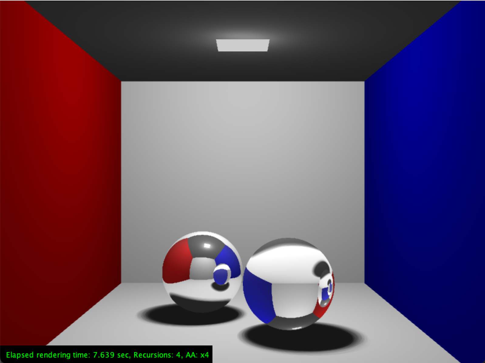
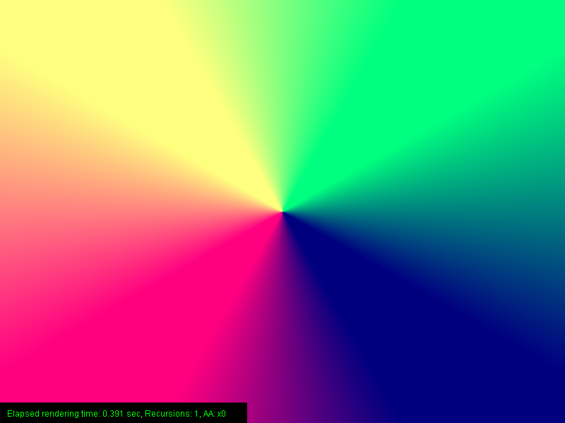
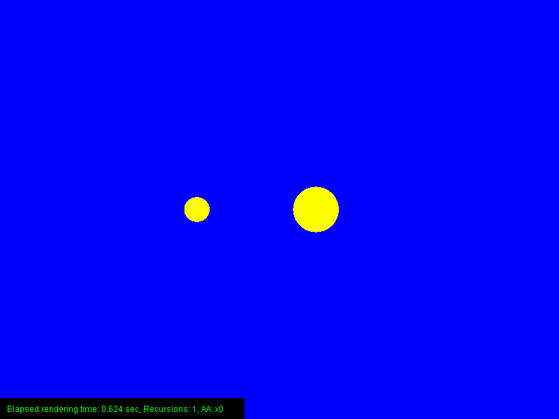
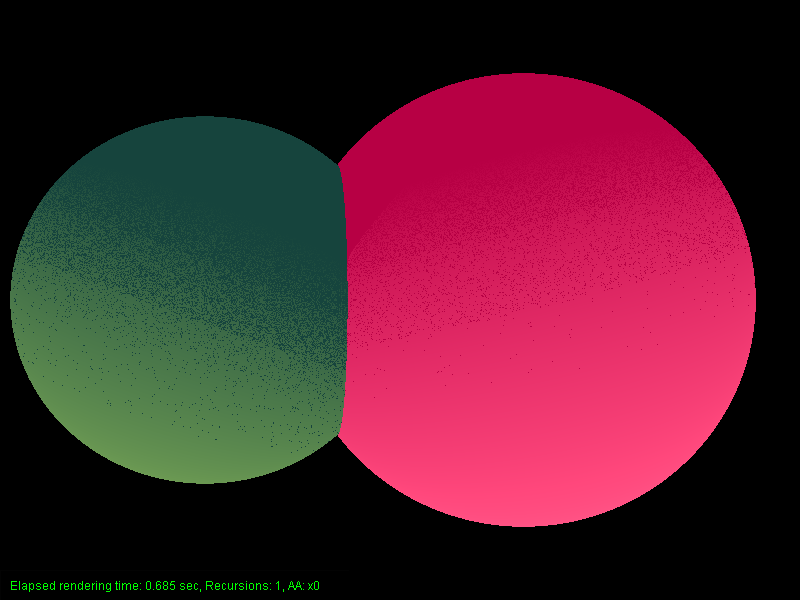
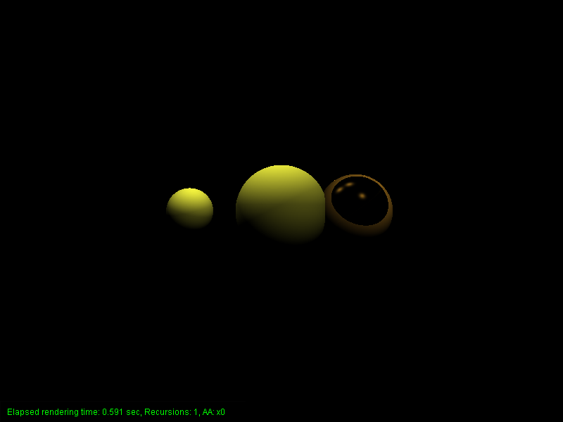
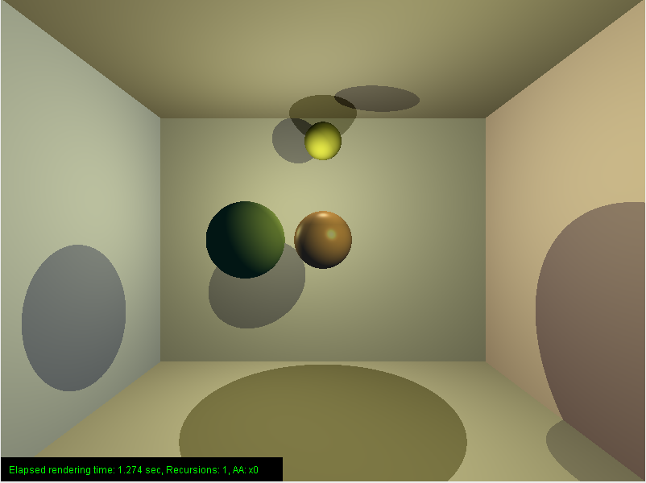
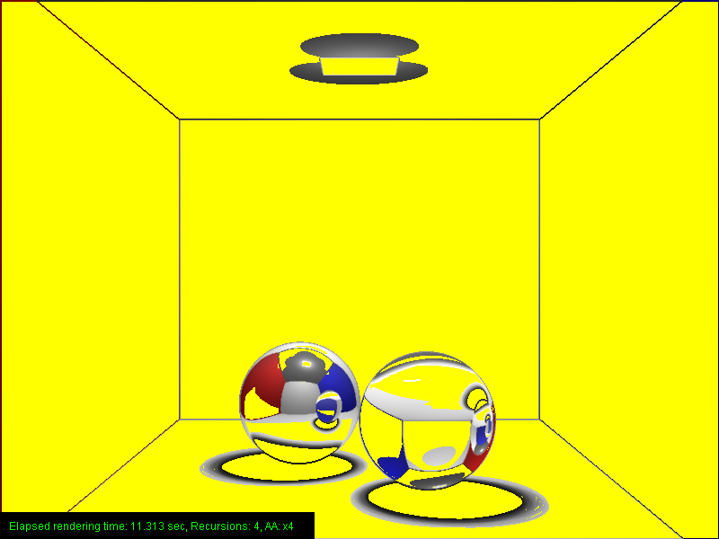

# Cornell box ray tracer
Simple ray tracer written in java showing a cornell box, a popular simulation environment for ray tracing of different materials.

    

In this sample, the cornell box contains a reflective (left) and a glas (right) sphere. The ray tracer was created as part of the advanced computer graphics course at HSD. It contains
- materials (blinn, lambert, phong)
- shapes (plane, sphere, square)
- light sources (area, point)
- optimizations (anti aliasing, edge detection)

## Render result samples
 

 

 
